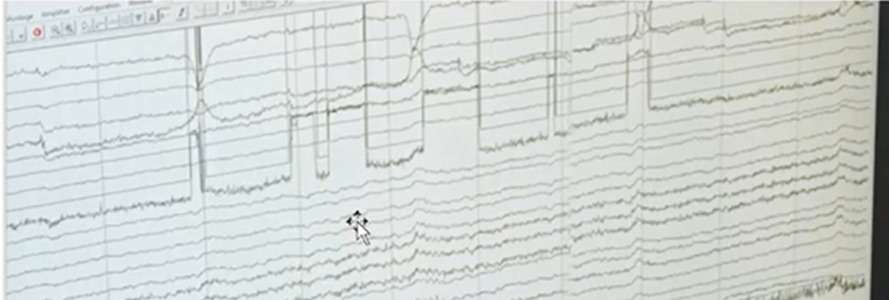
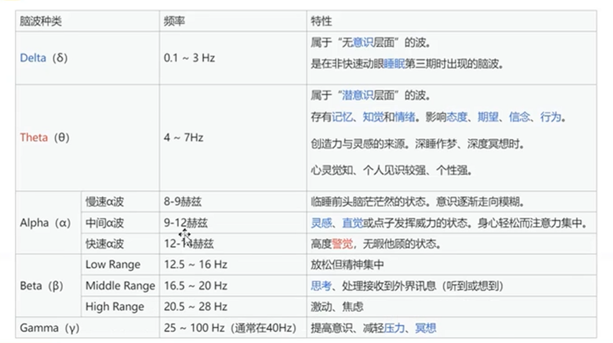
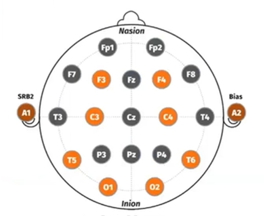

# 1.主要范式
介绍视频：[清华大学 高小榕教授](https://www.bilibili.com/video/BV1Kk4y1r7R8/)
## 1.1ERP事件相关电位
### 1.1.1P300
- **原理：**
人脑对瞬间视觉刺激的反应
- **特点：**
需要提前采集训练数据对系统进行矫正
- **举例：**
行列键盘打字
- **ITR**：
20-50bit/min
- **优化方法：**
	- 信号处理与模式识别方法
	- 刺激编码/刺激源的范式

### 1.1.2SSVEP稳态视觉诱发电位
- **原理：**
人脑对固定频率视觉刺激反应的主要成分，是刺激频率的同频及倍频成分
- **特点：**
无需训练，泛化能力强，适用于大部分人群
- **举例：**
行列键盘打字
- **ITR**：
100-300bit/min

## 1.2MI运动想象
- **原理：**
人脑想象不同部位运动的信号差异
- **特点：**
无需外界刺激，完全依靠自发性脑活动
需要额外训练，适用人群小
- **举例：**
机械臂控制

# 2.运动想象
教程视频：[运动想象任务简介](https://www.bilibili.com/video/BV1Bg4y1D7Rm)

运动想象是一种认知过程，想象你身体运动的一部分，而不实际移动身体的那个部分。它能够改变显性感觉运动区域的神经模式，接近实际运动执行。
## 2.1 原理
脑电图α和β频率对运动想象的影响最大。当人在头脑中**想象**某肢体运动时，α波和β波出现幅值上的**衰减**。
相反，若大脑**没有**进行运动**想象**任务，脑波α和脑波B频谱震荡的幅度会表现出明显的**增强**。

目前MI脑机接口使用较多的由想象**左手运动**、**右手运动**、**腿部运动**和舌部运动。

## 2.2信号处理
脑电信号处理流程：信号采集>>**信号预处理**>>**特征提取**>>**分类识别**>>控制命令>>反馈
### 2.2.1信号预处理
信号预处理主要指**滤波**，包括对信号进行时域、空域、频域等进行滤波，目的是减少信号中的伪迹与干扰，降低噪声对脑电信号的影响，**提升**与受试者思维活动任务相关的脑电信号的占比（即**信噪比**），以便进行后续分析。
### 2.2.2特征提取
对预处理的脑电信号进行时、空、频域的分析，将原始脑电信号不易被观察和检测的特征提取出来，以供分类器学习和分类，
特征提取法包括FFT（快速傅里叶）、小波变换以及功率谱估计等。当前最为广泛使用的算法为:**CSP(共空间模型)**、**FBCSP(滤波器组共空间模式)**和**OVR-FBCSP(一对多的滤波器组共空间模式)**、神经网络（？）
### 2.2.3分类识别
分析提取的信号特征进行分类器的构建，再使用分类器对不同类别的脑电信号进行分类，将其转化为控制命令输出给遥控器。
分类方法有KNN分类器、线性判别分类器Fisher分类器、支持向量机BP神经网络等。当然，现在主流是使用**CNN模型**进行分类，另外，**encoderdecoder框架**也被用于BCI的分类。

## 2.3波段

## 2.4电极定位
国际10-20标准化电极系统中的脑电图电极有22个，其中各个电极位置如下图所示：

|区域|功能  |
|--|--|
|P|视觉|
|C|运动|
|F|注意力|

